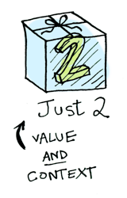

+++
title = "Applicative"
description = "Applicative"
chapter = true
weight = 10
pre = "<b>10. </b>"
+++

# Applicative
---
**Applicative** types are **Apply** types with one extra function, which we define in Fantasy Land as "**of**":
With **"of"**, we can take a value, and lift it into the given Applicative. That’s it! In the wild, most Apply types you practically use will also be Applicative.

---

With an applicative, our values are wrapped in a context, just like Functors:

But our functions are wrapped in a context too!

Applicative functor must know, how to apply a function wrapped in a context to a value wrapped in a context:

## Graphic

graph LR;
    A[Functor] --> B[Apply]
    B --> C[Applicative]


## Example (JavaScript):

See the Pen <a href="https://codepen.io/sanderv1992/pen/BVVrvP/">BVVrvP</a> by SanderV1992 (<a href="https://codepen.io/sanderv1992">@sanderv1992</a>) on <a href="https://codepen.io">CodePen</a>.

See the Pen <a href="https://codepen.io/sanderv1992/pen/pKKLjO/">pKKLjO</a> by SanderV1992 (<a href="https://codepen.io/sanderv1992">@sanderv1992</a>) on <a href="https://codepen.io">CodePen</a>.

## Example (Haskell):

> Just (+3) <*> Just 2
-- Just 5



> [(*2), (+3)] <*> [1, 2, 3]
-- [2, 4, 6, 4, 5, 6]



> (*) <$> Just 5 <*> Just 3
-- Just 15


---
#### Read More:
- http://www.tomharding.me/2017/04/17/fantas-eel-and-specification-9/
- http://adit.io/posts/2013-04-17-functors,_applicatives,_and_monads_in_pictures.html
- https://habr.com/post/183150/

